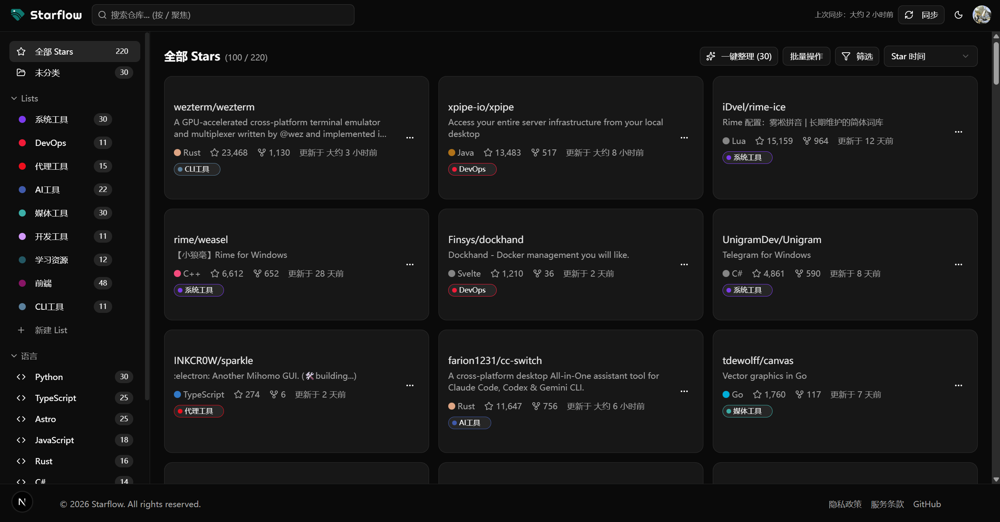
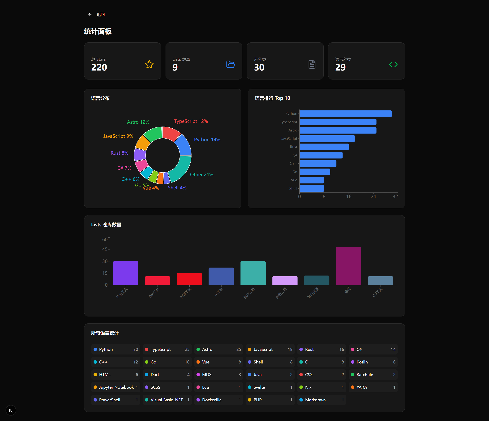
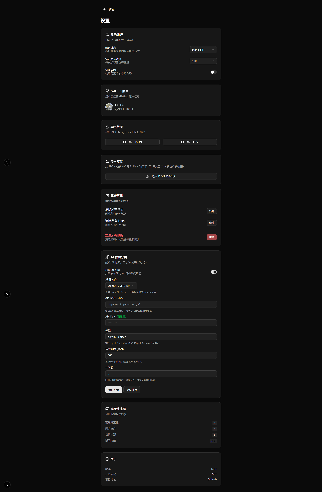
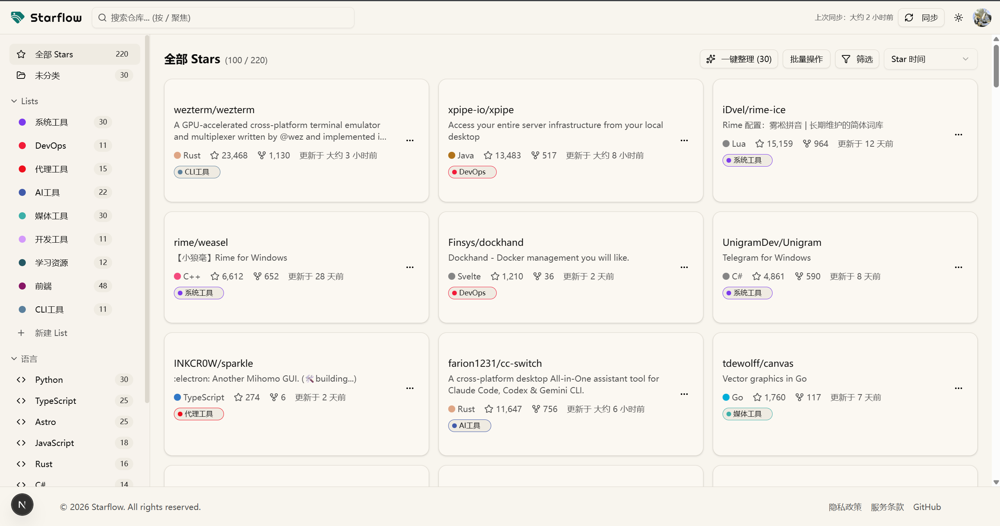
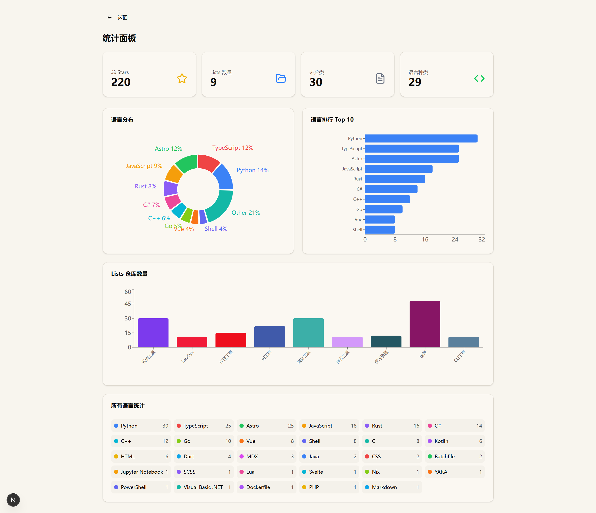
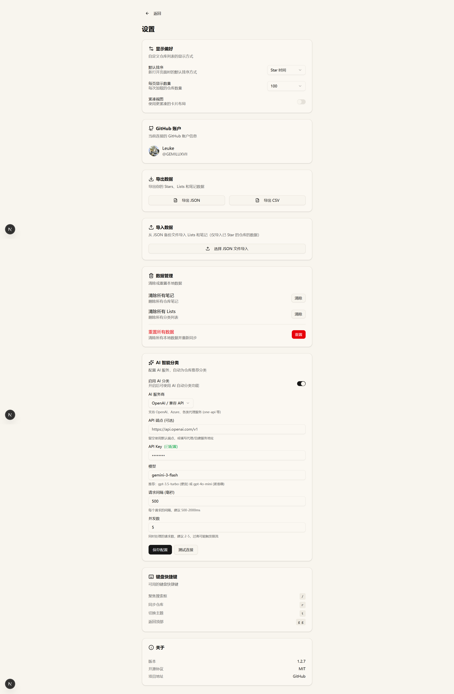

<div align="center">
  
</div>

# <div align="center">Starflow</div>

<div align="center">
  <strong>自托管的 GitHub Stars 管理工具 | A self-hosted GitHub Stars manager</strong>
</div>

<br>

<div align="center">
  <a href="https://github.com/GEMILUXVII/starflow/blob/main/LICENSE"></a>
  <a href="https://hub.docker.com/r/gemiluxvii/starflow"></a>
  <a href="https://nextjs.org/"></a>
</div>

<br>

<div align="center">
  <a href="#预览">预览</a> |
  <a href="#功能特性">功能特性</a> |
  <a href="#快速开始">快速开始</a> |
  <a href="#ai-分类">AI 分类</a> |
  <a href="#开发">开发</a> |
  <a href="CHANGELOG.md">更新日志</a>
</div>

<div align="center">
  <strong>中文</strong> | <a href="README_EN.md">English</a>
</div>

---

## 预览

<details>
<summary>🌙 暗色模式</summary>
<br>





</details>

<details>
<summary>☀️ 亮色模式</summary>
<br>





</details>

---

## 功能特性

### 核心功能

- **Lists 分类管理** - 创建自定义 Lists，将仓库按项目、技术栈或用途分类，支持 24 种预设颜色
- **AI 智能分类** - 接入 OpenAI 兼容 API，一键自动分类所有未整理的仓库
- **双向同步** - 与 GitHub 实时同步，取消 Star 也会同步到你的账号
- **README 预览** - 无需跳转即可查看仓库的 README 文档

### 搜索与筛选

- **全文搜索** - 按名称、描述快速搜索仓库
- **多维筛选** - 按语言、List、星标数、更新时间等筛选
- **排序方式** - 支持按 Star 时间、更新时间、星标数等排序

### 数据管理

- **笔记备注** - 为仓库添加个人笔记，记录使用心得和备忘
- **导入导出** - 支持 JSON/CSV 格式导出，便于备份和迁移
- **数据持久化** - PostgreSQL 存储，支持数据目录映射便于备份

### 用户体验

- **主题切换** - 支持亮色/暗色模式，偏好自动保存
- **键盘快捷键** - 支持快捷键操作，提升效率
- **响应式设计** - 适配桌面和移动端

---

## 快速开始

### 使用 Docker（推荐）

##### 创建 GitHub OAuth App

1. 访问 [GitHub Developer Settings](https://github.com/settings/developers)
2. 点击 "New OAuth App"
3. 填写信息：
   - Homepage URL: `https://你的域名`
   - Callback URL: `https://你的域名/api/auth/callback/github`

##### 环境变量

| 变量                   | 说明                                            |
| ---------------------- | ----------------------------------------------- |
| `GITHUB_CLIENT_ID`     | GitHub OAuth App Client ID                      |
| `GITHUB_CLIENT_SECRET` | GitHub OAuth App Client Secret                  |
| `NEXTAUTH_SECRET`      | 随机密钥（使用 `openssl rand -base64 32` 生成） |
| `NEXTAUTH_URL`         | 应用域名                                        |

##### 拉取镜像

```bash
docker pull gemiluxvii/starflow:latest
```

##### 创建 .env 文件

```bash
cat > .env << 'EOF'
GITHUB_CLIENT_ID=你的GitHub_Client_ID
GITHUB_CLIENT_SECRET=你的GitHub_Client_Secret
NEXTAUTH_SECRET=随机密钥
NEXTAUTH_URL=https://你的域名
EOF
```

##### 写入 docker-compose.yml

- curl 获取

```bash
curl -O https://raw.githubusercontent.com/GEMILUXVII/starflow/main/docker-compose.yml
```

- 或者复制下面的文本：

```yaml
services:
  starflow:
    image: gemiluxvii/starflow:latest
    container_name: starflow
    restart: unless-stopped
    ports:
      - "3000:3000"
    environment:
      - DATABASE_URL=postgresql://starflow:starflow@db:5432/starflow
      - GITHUB_CLIENT_ID=${GITHUB_CLIENT_ID}
      - GITHUB_CLIENT_SECRET=${GITHUB_CLIENT_SECRET}
      - NEXTAUTH_SECRET=${NEXTAUTH_SECRET}
      - NEXTAUTH_URL=${NEXTAUTH_URL}
    depends_on:
      db:
        condition: service_healthy

  db:
    image: postgres:16-alpine
    container_name: starflow-db
    restart: unless-stopped
    environment:
      - POSTGRES_USER=starflow
      - POSTGRES_PASSWORD=starflow
      - POSTGRES_DB=starflow
    volumes:
      - ./data/postgres:/var/lib/postgresql/data
    healthcheck:
      test: ["CMD-SHELL", "pg_isready -U starflow"]
      interval: 5s
      timeout: 5s
      retries: 5
```

##### 启动服务

```bash
docker compose up -d
```
##### 初始化数据库

```bash
docker compose exec starflow npx prisma db push --skip-generate
```

然后就可以在 http://serverip:3000 看到starflow的页面了

---

## AI 分类

Starflow 支持接入 OpenAI 兼容的 API 进行智能分类。

### 支持的服务

- OpenAI 官方 API
- 第三方中转站（自动兼容 /v1 路径）
- 本地部署的 Ollama、LocalAI 等

### 配置方式

1. 进入「设置」页面
2. 在「AI 分类」部分填写：
   - API 地址（如 `https://api.openai.com` 或中转站地址）
   - API Key
   - 模型名称（如 `gpt-3.5-turbo`）
3. 点击「测试连接」验证配置
4. 启用 AI 分类功能

### 分类说明

- 提供 15 种标准分类：AI工具、代理工具、CLI工具、前端、后端、数据库、DevOps、编辑器、开发工具、下载工具、媒体工具、安全工具、学习资源、系统工具、其他
- 支持单个仓库分类和批量一键分类
- 优先匹配已有 Lists，减少重复分类

---

### 数据备份

数据存储在 `./data/postgres` 目录，备份该目录即可：

```bash
# 备份
tar -czvf starflow-backup.tar.gz ./data

# 迁移到新服务器
tar -xzvf starflow-backup.tar.gz
docker compose up -d
```

---

## 开发

```bash
# 克隆仓库
git clone https://github.com/GEMILUXVII/starflow.git
cd starflow

# 安装依赖
pnpm install

# 配置环境变量
cp .env.example .env

# 初始化数据库
pnpm prisma generate
pnpm prisma db push

# 启动开发服务器
pnpm dev
```

---

## 技术栈

- **前端**: Next.js 15, React 19, Tailwind CSS 4, Radix UI
- **后端**: Next.js API Routes, NextAuth.js 5, Prisma 5
- **数据库**: PostgreSQL
- **AI**: OpenAI 兼容 API

---

## 许可证

[MIT](LICENSE)
